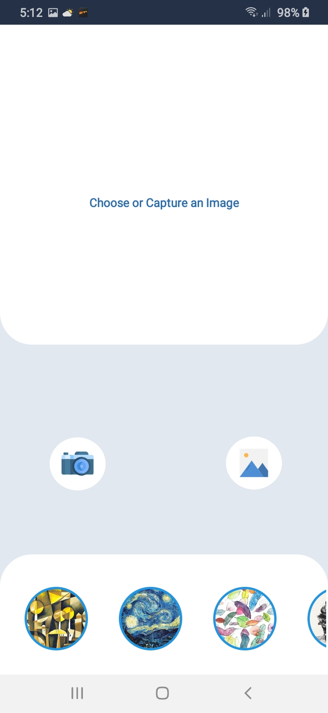

# PhotoFilters
 
This is an Android application called PhotoFilters which include two types of photo filters i.e. Augmented faces and Neural Style Transfer. Augmented Reality Face Filters are developed using Google AR Core. I have designed about 22 custom filters which include Glasses, Hats, Mustache and Beard etc and integrated them in my application. Whereas Artistic style transfer help you creat exciting image with sytle you like. It need two input images: one representing the artistic style and one representing the content.

<h2>Screenshots</h2>

 
 
 

<h3>Augmented Faces</h3>

 
 
 

  
 
 

  
 
 

  
 

<h3>Artistic Style Transfer</h3>

 
 
 
 

